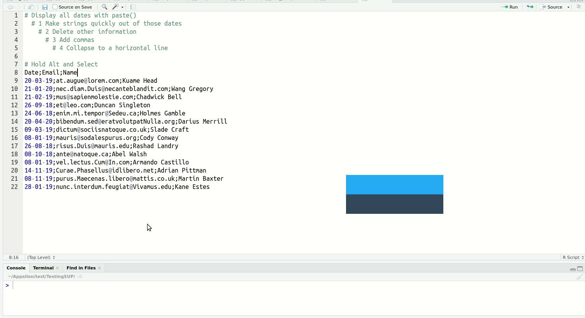

<style>
.reveal pre code {
  display: block;
  font-size: 1.5em;
  line-height: 1.1em;
  background-color: #E8E8E8;
  overflow: visible;
  max-height: none;
  word-wrap: normal;
}

.reveal section del {
  color: black;
  font-weight: bold;
}

.section .reveal .state-background {
   background: grey;
}

.reveal .controls div.navigate-left,
.reveal .controls div.navigate-left.enabled,
.reveal .controls div.navigate-left.enabled:hover{
  border-right-color: black;
}

.reveal .controls div.navigate-right,
.reveal .controls div.navigate-right.enabled,
.reveal .controls div.navigate-right.enabled:hover{
  border-left-color: black;
}

.reveal .progress span {
  background: black;
}

.reveal section img {
  border: none;
  box-shadow: none;
}
  

.exclaim .reveal .state-background {
  background: black;
} 

.exclaim .reveal h1,
.exclaim .reveal h2,
.exclaim .reveal p {
  color: white;
}

</style>


Basic R for economics
========================================================
author: Lars Hernandez Nielsen
date: 31.10.19
width: 1920
height: 1080
navigation: section
  


<div align="center">

</div>

Overview
========================================================

## Ignore
- SPSS
- Eviews
- MATLAB
- Stata

## Try to ignore
- SAS
- Excel/VBA

## Focus on
- R
- Python

## Keep an eye on
- Julia

***
## Important R people
- Hadley Wicham (tidyverse)
- Matt Dowle (data.table)
- Max Kuhn (CARET)

## How to follow R
- follow rbloggers on Facebook
- follow #rstats on twitter
- stackoverflow/crossvalidated
- AalborgRUG (meetup)


History
========================================================

compiled vs. interpeted languages

- R created in 1993 from the language S
- Quickly adopted by statestians
- inspired pandas in python
- split into 3 dialects (`base`, `datatable`, `tidyverse`)


file extension: .r og .rdata

## difference
- Python - If you want to work with engeeneis
- R - If you want to work with statestians

Data Structures
========================================================

- ~~Vector~~
The most basic structure, evel a single value is a vector in R. It takes different forms, the most usefull are numeric, character, factor and date.
  
- ~~Matrix~~
You can bind numeric vectors of same length together to form a matrix
  
- ~~Data frame~~
You can bind different types of vectors together to form a data frame
  
- ~~List~~
You can put all the above in a list, it can have objects of different dimensions

***

```r
class(1)
```

```
[1] "numeric"
```

```r
class(c(1,2,3,4,5))
```

```
[1] "numeric"
```

```r
class(c("A","B","D"))
```

```
[1] "character"
```

```r
class(as.matrix(c(1,2,3,4,5)))
```

```
[1] "matrix"
```

```r
class(as.data.frame(c(1,2,3,4,5)))
```

```
[1] "data.frame"
```

```r
class(as.list(c(1,2,3,4,5)))
```

```
[1] "list"
```


Logical operations
========================================================

Very usefull in many cases

- subsetting (filtering)
- ifelse
- group_by/facet_wrap

***


```r
1 > 2
```

```
[1] FALSE
```

```r
1 == 1
```

```
[1] TRUE
```

```r
a <- c(2,3,4) < c(1,5,6)
a
```

```
[1] FALSE  TRUE  TRUE
```

```r
sum(a)
```

```
[1] 2
```


Functions
========================================================
Functions are usefull for repetative work. lets say we have to find the mean of a vector many times (and we assume you've forgotten the mean() function)


```r
my_mean <- function(x) {sum(x)/length(x)}

z <- rnorm(n = 10, mean = 4)
z
```

```
 [1] 1.608812 4.516379 4.320420 4.650014 4.169747 5.701009 4.512256 5.843102
 [9] 2.639855 1.489207
```

```r
my_mean(z)
```

```
[1] 3.94508
```


Apply family
========================================================
The apply family gets a bit advanced and confusing, but it's about using functions within functions. If we would like to calculate all mean values of a dataframe we can apply this function on a dataframe


```r
df <- data.frame(x = rnorm(n = 100, mean = 0),
                 y = rnorm(n = 100, mean = 4),
                 z = rnorm(n = 100, mean = 8))
head(df)
```

```
           x        y        z
1  0.6733856 3.271608 9.372090
2  1.0029174 4.465537 8.718469
3 -0.5127380 4.828044 6.776003
4 -1.3111109 3.896242 8.094523
5  1.3817918 4.631874 8.217721
6  0.8619629 3.416283 8.024398
```

```r
apply(df, MARGIN = 2, FUN = my_mean)
```

```
       x        y        z 
0.171587 3.920761 8.021660 
```

FUN specifies the function and MARGIN specifies wether to apply to rows or columns. You could get the same result with a forloop but often apply will be more effecient.


Converting from wide to long data format
========================================================
- Extremly important to understand
- Long (tidy data) is always prefered, but sometimes in the process you have to go back and forth between them
- In Excel this is known as pivot tables

In the tidyverse this has gone throgh a few names
- melt -> gather -> pivot_longer
- cast -> spread -> pivot_wider


```r
relig_income[,1:4] %>% 
  head()
```

```
# A tibble: 6 x 4
  religion           `<$10k` `$10-20k` `$20-30k`
  <chr>                <dbl>     <dbl>     <dbl>
1 Agnostic                27        34        60
2 Atheist                 12        27        37
3 Buddhist                27        21        30
4 Catholic               418       617       732
5 Don’t know/refused      15        14        15
6 Evangelical Prot       575       869      1064
```

***


```r
long <- relig_income[,1:4] %>% 
  pivot_longer(names_to = "income", 
               values_to = "value", 
               -religion)
head(long, 18)
```

```
# A tibble: 18 x 3
   religion           income  value
   <chr>              <chr>   <dbl>
 1 Agnostic           <$10k      27
 2 Agnostic           $10-20k    34
 3 Agnostic           $20-30k    60
 4 Atheist            <$10k      12
 5 Atheist            $10-20k    27
 6 Atheist            $20-30k    37
 7 Buddhist           <$10k      27
 8 Buddhist           $10-20k    21
 9 Buddhist           $20-30k    30
10 Catholic           <$10k     418
11 Catholic           $10-20k   617
12 Catholic           $20-30k   732
13 Don’t know/refused <$10k      15
14 Don’t know/refused $10-20k    14
15 Don’t know/refused $20-30k    15
16 Evangelical Prot   <$10k     575
17 Evangelical Prot   $10-20k   869
18 Evangelical Prot   $20-30k  1064
```


Relational algebra
========================================================
One of the most key things in R, and one of the big reasons for it's success. it's the main ingredient in pandas (python), dplyr and data.table. The operations are possible in base R, but more complicated.

We use the long dataframe of relic_income from before:


```r
long <- relig_income %>% 
  pivot_longer(names_to = "income", 
               values_to = "value", 
               -religion)

long %>% group_by(religion) %>% summarize(n = n())
```

```
# A tibble: 18 x 2
   religion                    n
   <chr>                   <int>
 1 Agnostic                   10
 2 Atheist                    10
 3 Buddhist                   10
 4 Catholic                   10
 5 Don’t know/refused         10
 6 Evangelical Prot           10
 7 Hindu                      10
 8 Historically Black Prot    10
 9 Jehovah's Witness          10
10 Jewish                     10
11 Mainline Prot              10
12 Mormon                     10
13 Muslim                     10
14 Orthodox                   10
15 Other Christian            10
16 Other Faiths               10
17 Other World Religions      10
18 Unaffiliated               10
```

***


```r
long %>% group_by(religion) %>% summarize(n = sum(value))
```

```
# A tibble: 18 x 2
   religion                    n
   <chr>                   <dbl>
 1 Agnostic                  826
 2 Atheist                   515
 3 Buddhist                  411
 4 Catholic                 8054
 5 Don’t know/refused        272
 6 Evangelical Prot         9472
 7 Hindu                     257
 8 Historically Black Prot  1995
 9 Jehovah's Witness         215
10 Jewish                    682
11 Mainline Prot            7470
12 Mormon                    581
13 Muslim                    116
14 Orthodox                  363
15 Other Christian           129
16 Other Faiths              449
17 Other World Religions      42
18 Unaffiliated             3707
```

```r
long %>% group_by(income) %>% summarize(n = sum(value))
```

```
# A tibble: 10 x 2
   income                 n
   <chr>              <dbl>
 1 $10-20k             2781
 2 $100-150k           3197
 3 $20-30k             3357
 4 $30-40k             3302
 5 $40-50k             3085
 6 $50-75k             5185
 7 $75-100k            3990
 8 <$10k               1930
 9 >150k               2608
10 Don't know/refused  6121
```


For-loops
========================================================

For-loops are easy and usefull, but can sometimes be slow


```r
y = rbinom(100, 1, prob = 0.5)
x = abs(rnorm(100)) + y * 2

g <- glm(y ~ x, family = "binomial")
g
```

```

Call:  glm(formula = y ~ x, family = "binomial")

Coefficients:
(Intercept)            x  
     -11016         5450  

Degrees of Freedom: 99 Total (i.e. Null);  98 Residual
Null Deviance:	    138.6 
Residual Deviance: 5.783e-06 	AIC: 4
```

```r
plot(x, y, ylim=c(-0.5,1.5))
curve(predict(g, data.frame(x), type="resp"), add = TRUE)
```


***
We can put this simple logistic model into a for-loop


```r
fits <- NA

for (i in 1:10) {
  
  y   <- rbinom(100, 1, prob = 0.5)
  x   <- abs(rnorm(100)) + y * 2
  fit <- glm(y ~ x, family = "binomial")
  
  fits[i] <- fit$coefficients[[2]]
  
}

fits
```

```
 [1]    4.566354    8.508347    5.705026    8.065975   19.926424 1308.356866
 [7]    6.268552    8.980511    6.568836  110.454141
```


Simple functions that are extremly usefull
====================================
- operators: <, <=, ==, >=, >, %in%, !
- table()
- subset()
- ifelse()
- simulate: rnorm(), runif(), rbinom()
- class(), str(), summary()
- seq(), rep()

***

```r
df <- data.frame(x = sample(c("A","B"), 
                            prob = c(0.2,0.8), 
                            size = 100, 
                            replace=T),
                 y = rep(c("Apple","pear",
                           "Apple","bananna"), 
                         25))
head(df)
```

```
  x       y
1 B   Apple
2 B    pear
3 B   Apple
4 A bananna
5 B   Apple
6 B    pear
```

```r
table(df$x, df$y)
```

```
   
    Apple bananna pear
  A     9       9    6
  B    41      16   19
```


Can it do calculus?
========================================================
Lets say we have a more normal mathematical function, we can write it in R

$$f(x) = \bigg(x^3cos\frac{x}{2}+\frac{1}{2}\bigg)\sqrt{4-x^2}$$


```r
fun <- function(x) {
  (x^3 * cos(x/2) + 1/2) * sqrt(4 - x^2)
  }
```


```r
fun(1)
```

```
[1] 2.386043
```

```r
fun(-1)
```

```
[1] -0.6539922
```

***
What if we would like now to integrate this function within an interval?

$$\int_{-2}^{2}\bigg(x^3cos\frac{x}{2}+\frac{1}{2}\bigg)\sqrt{4-x^2}\ dx$$


```r
integrate(fun, -2, 2)
```

```
3.141593 with absolute error < 2e-09
```


```r
ggplot(data.frame(x = 0), aes(x)) + 
  stat_function(fun = fun) + 
  xlim(-2,2)
```


Examples
========================================================

## Question A (hard)
With 1000 coin tosses you get a head 530 times $p=0.53$, is this a fair coin? calculate the confidence 95% confidence intervals with the following formula:

$$CI=\pm 1.96 \sqrt{\frac{p(1-p)}{n}}$$

How can you know if this formula is true? We can calculate the coverage and verify that the calculation of confidence intervals.

1. Simulate 1000 coin tosses with $P = 0.5$ and calulate UCL and LCI (use rbinom() to simulate cointosses)
2. We know that 0.5 should be within this interval 95% of times, so with logical operators check wether 0.5 is contained within the confidence intervals
3. In a forloop run the above 100 times and each time save the TRUE or FALSE value within a vector
4. sum the vector


  
***

## Question B (easy)
You simulate a x and y vector each with 1000 obs in R with rnorm(), and calculate 


```r
set.seed(1)
x <- rnorm(1000)
y <- rnorm(1000)
z <- rnorm(1000)
lm(y ~ x + z)
```

```

Call:
lm(formula = y ~ x + z)

Coefficients:
(Intercept)            x            z  
  -0.016544     0.005328     0.022451  
```

check the calculation of the coeffecients using the matrix formula 

$$\hat{\beta}_{OLS}=(X'X)^{-1}X'Y$$

If the results don't fit, did you forget intercept? lm(y~0+x)


Examples
========================================================

## Inequality simulation
Imagine you are offered the following bet with the probarbility of 50% $P$ to either increase or decrease your total wealth $M$

$$
result = P(1.5*M) | P(0.6*M)
$$

  1. What is the expected value of this bet $E(result)$
  
  2. Since this is a good bet, what would the effect be on the wealth of soeicity if we let all 5 million people in denmark do this bet 100 times?
  create 
  
  3. What would be the effect on the average person?

See code on the right for help:
***


```r
set.seed(3)
individuals <- 100
bets        <- 100
cash        <- 100

mat <- matrix(data = NA, 
              nrow = individuals, 
              ncol = bets)

for (j in 1:individuals) {
  for (i in 1:(bets-1)) {
    cash[i+1] <- ifelse(rnorm(1) > 0, 
                        cash[i] * 0.6, 
                        cash[i] * 1.5)
  }
  mat[j,] <- cash
}
```

Inequality simulation 2/2
========================================================

## Results of simulation:


How to include models and plots in Projects?
========================================================
type: section


Stargazer 1/4
========================================================

Stargazer is a really nice R package to include models in your projects

- replicates format of journals
- prints to latex and html
- handles many different models (lm, glm, arima, garch, coxph, IVreg)

```r
library(stargazer)
library(AER)
```


```r
data("CPS1985")
head(CPS1985)
```

```
      wage education experience age ethnicity region gender occupation
1     5.10         8         21  35  hispanic  other female     worker
1100  4.95         9         42  57      cauc  other female     worker
2     6.67        12          1  19      cauc  other   male     worker
3     4.00        12          4  22      cauc  other   male     worker
4     7.50        12         17  35      cauc  other   male     worker
5    13.07        13          9  28      cauc  other   male     worker
            sector union married
1    manufacturing    no     yes
1100 manufacturing    no     yes
2    manufacturing    no      no
3            other    no      no
4            other    no     yes
5            other   yes      no
```

Stargazer 2/4
========================================================


```r
m <- lm(wage ~ education + 
               experience + 
               age + 
               gender, 
        data = CPS1985)

summary(m)
```

```

Call:
lm(formula = wage ~ education + experience + age + gender, data = CPS1985)

Residuals:
   Min     1Q Median     3Q    Max 
-9.571 -2.745 -0.652  1.894 37.736 

Coefficients:
             Estimate Std. Error t value Pr(>|t|)    
(Intercept)   -1.9574     6.8350  -0.286    0.775    
education      1.3073     1.1201   1.167    0.244    
experience     0.4811     1.1205   0.429    0.668    
age           -0.3675     1.1195  -0.328    0.743    
genderfemale  -2.3442     0.3889  -6.028 3.12e-09 ***
---
Signif. codes:  0 '***' 0.001 '**' 0.01 '*' 0.05 '.' 0.1 ' ' 1

Residual standard error: 4.458 on 529 degrees of freedom
Multiple R-squared:  0.2533,	Adjusted R-squared:  0.2477 
F-statistic: 44.86 on 4 and 529 DF,  p-value: < 2.2e-16
```


Stargazer 3/4
========================================================


```r
m1 <- lm(wage ~ education + 
                experience + 
                age + 
                gender, 
         data = CPS1985)

m2 <- lm(wage ~ education + 
                experience + 
                age + 
                gender + 
                ethnicity, 
         data = CPS1985)

m3 <- lm(wage ~ education + 
                experience + 
                age + 
                gender + 
                ethnicity + 
                married, 
         data = CPS1985)

stargazer(m1, m2, m3, 
          column.labels = c("Good", 
                            "Better", 
                            "Best"),
          single.row = TRUE)
```

***

<div align="center">

</div>


Stargazer 4/4
========================================================


```r
stargazer(m1, m2, m3, column.labels = c("Good","Better", "Best"))
```

```

% Table created by stargazer v.5.2.2 by Marek Hlavac, Harvard University. E-mail: hlavac at fas.harvard.edu
% Date and time: ma, dec 02, 2019 - 09:02:10
\begin{table}[!htbp] \centering 
  \caption{} 
  \label{} 
\begin{tabular}{@{\extracolsep{5pt}}lccc} 
\\[-1.8ex]\hline 
\hline \\[-1.8ex] 
 & \multicolumn{3}{c}{\textit{Dependent variable:}} \\ 
\cline{2-4} 
\\[-1.8ex] & \multicolumn{3}{c}{wage} \\ 
 & Good & Better & Best \\ 
\\[-1.8ex] & (1) & (2) & (3)\\ 
\hline \\[-1.8ex] 
 education & 1.307 & 1.272 & 1.331 \\ 
  & (1.120) & (1.120) & (1.120) \\ 
  & & & \\ 
 experience & 0.481 & 0.457 & 0.515 \\ 
  & (1.121) & (1.120) & (1.120) \\ 
  & & & \\ 
 age & $-$0.367 & $-$0.343 & $-$0.407 \\ 
  & (1.120) & (1.119) & (1.120) \\ 
  & & & \\ 
 genderfemale & $-$2.344$^{***}$ & $-$2.362$^{***}$ & $-$2.357$^{***}$ \\ 
  & (0.389) & (0.389) & (0.389) \\ 
  & & & \\ 
 ethnicityhispanic &  & $-$0.334 & $-$0.310 \\ 
  &  & (0.894) & (0.894) \\ 
  & & & \\ 
 ethnicityother &  & $-$0.956 & $-$0.924 \\ 
  &  & (0.586) & (0.586) \\ 
  & & & \\ 
 marriedyes &  &  & 0.518 \\ 
  &  &  & (0.423) \\ 
  & & & \\ 
 Constant & $-$1.957 & $-$1.823 & $-$1.602 \\ 
  & (6.835) & (6.833) & (6.832) \\ 
  & & & \\ 
\hline \\[-1.8ex] 
Observations & 534 & 534 & 534 \\ 
R$^{2}$ & 0.253 & 0.257 & 0.259 \\ 
Adjusted R$^{2}$ & 0.248 & 0.249 & 0.249 \\ 
Residual Std. Error & 4.458 (df = 529) & 4.455 (df = 527) & 4.452 (df = 526) \\ 
F Statistic & 44.865$^{***}$ (df = 4; 529) & 30.402$^{***}$ (df = 6; 527) & 26.298$^{***}$ (df = 7; 526) \\ 
\hline 
\hline \\[-1.8ex] 
\textit{Note:}  & \multicolumn{3}{r}{$^{*}$p$<$0.1; $^{**}$p$<$0.05; $^{***}$p$<$0.01} \\ 
\end{tabular} 
\end{table} 
```


ggplot 1/2
========================================================


```r
CPS1985 %>% 
  ggplot(aes(age, wage)) + 
  geom_point() + 
  geom_smooth(method = "lm") +
  labs(title="Does age influence wage?")
```


***


```r
CPS1985 %>% 
  ggplot(aes(age, wage)) + 
  geom_point() + 
  geom_smooth(method = "lm") +
  facet_wrap(~ occupation, nrow = 2)
```


ggplot 2/3
========================================================


```r
CPS1985 %>% ggplot(aes(age)) + 
  geom_histogram(bins=15) + 
  facet_wrap(~ married) +
  labs(title="How is age distributed within the marriage variable?")
```


ggplot 3/3
========================================================
We can also do multiple plots, there are two packages for this, gridExtra and patchwork, here is an example of patchwork


```r
library(patchwork)

p1 <- CPS1985 %>% ggplot(aes(wage)) + geom_histogram(bins=15)
p2 <- CPS1985 %>% ggplot(aes(wage)) + geom_histogram(bins=30)
p3 <- CPS1985 %>% ggplot(aes(wage)) + geom_histogram(bins=60)

p1 + p2 + p3
```


```r
ggsave(p1, filename = "p1.pdf", width = 5, height = 4, units = "in")
```


Getting data through an API
====================================
type: section


API accest to DST with statsDK 1/5
========================================================


```r
#devtools::install_github("mikkelkrogsholm/statsDK")
library(statsDK)
```


```r
# First we look for interesting datasets, look at the file and use the search function
tables <- sdk_retrieve_tables()
head(tables)
```

```
# A tibble: 6 x 8
  id     text          unit  updated   firstPeriod latestPeriod active variables
  <chr>  <chr>         <chr> <chr>     <chr>       <chr>        <lgl>  <list>   
1 FOLK1A Population a~ numb~ 2019-11-~ 2008Q1      2019Q4       TRUE   <chr [5]>
2 FOLK1B Population a~ numb~ 2019-11-~ 2008Q1      2019Q4       TRUE   <chr [5]>
3 FOLK1C Population a~ numb~ 2019-11-~ 2008Q1      2019Q4       TRUE   <chr [6]>
4 FOLK1D Population a~ numb~ 2019-11-~ 2008Q1      2019Q4       TRUE   <chr [5]>
5 FOLK1E Population a~ numb~ 2019-11-~ 2008Q1      2019Q4       TRUE   <chr [5]>
6 FOLK2  Population 1~ numb~ 2019-02-~ 1980        2019         TRUE   <chr [6]>
```


statsDK 2/5
========================================================


```r
# Use the following to get an idea of the variables
meta <- sdk_retrieve_metadata("NRHP")
variables <- sdk_get_variables(meta)
```


```r
# Specify what data and variables you want to collect
GDP <- sdk_retrieve_data("NRHP", Tid = "*", TRANSAKT = "B1GQD", PRISENHED = "V_C")

# Convert to numeric and time for easier handeling
GDP$INDHOLD <- as.numeric(GDP$INDHOLD)
GDP$TID <- as.Date(ISOdate(GDP$TID, 1, 1))

# Rename Område so Å don't cause problems (conflicts with reshape2)
GDP <- rename(GDP, AREA = OMRÅDE)

head(GDP)
```

```
# A tibble: 6 x 5
  TID        TRANSAKT            PRISENHED                AREA           INDHOLD
  <date>     <chr>               <chr>                    <chr>            <dbl>
1 2014-01-01 B.1*g Gross domest~ Pr. capita. Current pri~ Province Nord~     293
2 2014-01-01 B.1*g Gross domest~ Pr. capita. Current pri~ Outside regio~      NA
3 2014-01-01 B.1*g Gross domest~ Pr. capita. Current pri~ All Denmark        351
4 2014-01-01 B.1*g Gross domest~ Pr. capita. Current pri~ Province Byen~     502
5 2014-01-01 B.1*g Gross domest~ Pr. capita. Current pri~ Province Sydj~     351
6 2014-01-01 B.1*g Gross domest~ Pr. capita. Current pri~ Region Nordjy~     293
```


```r
ggplot(GDP, aes(TID, INDHOLD, color = AREA)) + 
  geom_line()
```


statsDK 3/5
========================================================


```r
GDP %>% 
  filter(str_detect(AREA, "Region")) %>% 
  ggplot(aes(TID, INDHOLD)) + 
  geom_line() + facet_wrap(~AREA)
```


```r
GDP %>% 
  filter(str_detect(AREA, "Province")) %>% 
  ggplot(aes(TID, INDHOLD)) + 
  geom_line() + facet_wrap(~AREA)
```


statsDK 4/5
========================================================
left: 40%


```r
library(sf)

geo_sf <- read_sf("https://dawa.aws.dk/Sogne/?format=geojson")
KMGALDER <- sdk_retrieve_data("KMGALDER", Tid = "2019", Køn = "TOT")
KM <- subset(KMGALDER, KMGALDER$KØN != "Total")
KM$kode  <- str_extract(KM$SOGN, "[:digit:]+")
KM$INDHOLD <- KM$INDHOLD/10

KM %>% 
  left_join(geo_sf, ., by = c('kode' = 'kode')) %>% 
  ggplot() + 
  geom_sf(aes(fill = INDHOLD, color = INDHOLD)) +  
  coord_sf(xlim = c(8.5, 11.5), ylim = c(56.5, 57.5), expand = FALSE) +
  theme_minimal()
```

***

<div align="center">

</div>


API acess with Quandl
====================================

- Create user to get API key


```r
library(Quandl)
library(tidyverse)
library(lubridate)

ZERO <- Quandl("FED/SVENY", api_key = key)
head(ZERO)[1:4]
```

***


```r
range(ZERO$Date)
difftime(range(ZERO$Date)[2],range(ZERO$Date)[1])

nrow(ZERO)
```


Quandl 2/9
====================================


Quandl 3/9
====================================


```r
ZERO %>% 
  pivot_longer(-Date, names_to = "Maturity", values_to = "Value") %>% 
  mutate(Maturity = as.numeric(str_extract(Maturity, pattern="[:digit:]+"))) %>% 
  ggplot(aes(Date, Value, group=Maturity, color=Maturity)) + geom_line(alpha=1)
```

Quandl 4/9
====================================


```r
ZERO %>% pivot_longer(-Date, names_to = "Maturity", values_to = "Value") %>% 
  mutate(Maturity = as.numeric(str_extract(Maturity, pattern="[:digit:]+"))) %>% 
  filter(Date>as.Date("1989-12-31")) %>% 
  ggplot(aes(Maturity, Value, group=Date)) + geom_line(alpha=0.1) + 
  facet_wrap(~year(Date), scales = "free")
```


Quandl 5/9
====================================


```r
ZERO_S <- ZERO %>% filter(Date > "2000-01-01") %>% subset(day(Date) == 1) 
ZERO_M <- ZERO_S %>% dplyr::select(-Date) %>% as.matrix()
date <- rev(decimal_date(ZERO_S$Date))
mat <- apply(ZERO_M,2,rev)
persp(x = date, y = c(1:30), z = mat, theta = 40, phi = 25, expand = 0.4,
      ticktype = "detailed", ylab = "L?betid", xlab = "", zlab = "Rente")
```


Quandl 6/9
====================================
incremental: true


```r
Quandl("FRED/BASE", api_key = key) %>% 
  ggplot(aes(Date, Value)) + 
  geom_line() + 
  geom_ribbon(aes(ymin=0, ymax = Value), alpha = 0.4) +
  labs(title = "US high-powered money (monetary base)",
       subtitle = "What happened in 2008?\nWhy didn't this result in inflation?")
```


***


```r
Quandl("FRED/WRBWFRBL", api_key = key) %>% 
  ggplot(aes(Date, Value/1000)) + 
  geom_line() + 
  geom_ribbon(aes(ymin=0, ymax = Value/1000), alpha = 0.4) +
  labs(title = "Liabilities and Capital: Other Factors Draining Reserve Balances:",
       subtitle="Reserve Balances With Federal Reserve Banks: Wednesday Level")
```


Quandl 7/9
====================================


```r
tib <- tibble(QE    = as.Date(c("2008-10-01", "2010-12-01", "2012-12-01")), 
              names = c("QE1","QE2","QE3"))

Quandl("FRED/BASE", api_key = key) %>% 
  filter(Date >= as.Date("2000-01-01")) %>% 
  ggplot(aes(Date, Value)) + 
  geom_line() + geom_ribbon(aes(ymin=0, ymax=Value), alpha = 0.4) +
  geom_segment(data = tib, aes(x = QE, xend=QE, y=0, yend=4450), linetype="dashed") +
  geom_text(data = tib, aes(x = QE, y = 4750, label = paste(names,"\n",QE)), size = 3.5) +
  scale_y_continuous(limits=c(0,5000)) +
  labs(title = "US high-powered money (monetary base)")
```


Quandl 8/9
====================================


```r
FRED <- c("INDPRO","UNRATE","M2REAL","OILPRICE","CPIAUCSL")
data <- Quandl(paste0("FRED/", FRED), api_key = key) %>% 
  filter(Date >= "1959-01-01", Date < "2019-01-01")

colnames(data)[-1] <- str_sub(colnames(data)[-1], 1, str_length(colnames(data)[-1]) - 8)
colnames(data)[-1] <- str_sub(colnames(data)[-1], 6)

data %>% pivot_longer(-Date, names_to = "Variable", values_to = "Value") %>% 
  ggplot(aes(Date, Value)) + 
  geom_line() + facet_wrap(~Variable, scales="free", nrow=1) +
  geom_ribbon(aes(ymax=Value, ymin=0), alpha=0.4) +
  labs(title="Interesting variables")
```


Quandl 9/9
====================================


```r
FRED <- c("UEMPLT5","UEMP5TO14","UEMP15OV","UEMP15T26","UEMP27OV")
data <- Quandl(paste0("FRED/", FRED), api_key = key) %>% 
  filter(Date >= "1959-01-01", Date < "2019-01-01")

colnames(data)[-1] <- str_sub(colnames(data)[-1], 1, str_length(colnames(data)[-1]) - 8)
colnames(data)[-1] <- str_sub(colnames(data)[-1], 6)

data %>% pivot_longer(-Date, names_to = "Variable", values_to = "Value") %>% 
  ggplot(aes(Date, Value, color=Variable, group=Variable)) + 
  scale_color_brewer(palette="Blues", direction=-1) +
  geom_line(size=1) +
  labs(title="Different types of unemployment")
```


Other Examples
====================================
type: section


Solving system of linear eqations
====================================

$$1x + 2y + 3x = 20$$
$$2x + 5y + 9z = 100$$
$$5x + 7y + 8z = 200$$


```r
A <- rbind(c(1, 2, 3), 
           c(2, 5, 9),
           c(5, 7, 8))    
b <- cbind(c(20,100,200)) # use cbind to make column in a matrix
solve(A, b)
```

```
     [,1]
[1,]  320
[2,] -360
[3,]  140
```


Generalized method of moments
====================================
We estimate a linear model with an endogeneity problem

$$y_i = 0.1 W_i + \varepsilon_i$$

$$W_i = e^{-x^2_i}+u_i$$

$$\varepsilon_i,e_i ~ N (0,\Sigma) \qquad \Sigma = \begin{pmatrix} 
1 & 0.9 \\
0.9 & 1 
\end{pmatrix}$$


```r
library(mvtnorm) # Multivariate rnorm
library(gmm)     # Generalised Method of Moments

n <- 1000
e <- rmvnorm(n, sigma = matrix(c(1.0, 0.9, 0.9, 1.0),2, 2))
cor(e)
```

```
          [,1]      [,2]
[1,] 1.0000000 0.8957488
[2,] 0.8957488 1.0000000
```


***


```r
x <- rnorm(n)
w <- exp(-x^2) + e[,1]
y <- 0.1 * w + e[,2]
df <- tibble(y, w)

ggplot(df, aes(w, y)) + 
  geom_point(shape = 21, alpha=0.2) + 
  labs(title = "Data with an endogeneity problem")
```


Generalized method of moments
====================================


```r
instruments <- cbind(x, x^2, x^3)
fit_gmm <- gmm(y ~ w, x = instruments)
fit_ols <- lm(y ~ w)

fits <- tibble(gmm  = fitted(fit_gmm), 
               ols  = fitted(fit_ols), w = w,
               true = w * 0.1) %>% gather(variable, value, -w)

ggplot(df, aes(w, y)) + 
  geom_point(shape = 21, alpha=0.2) +
  geom_line(data = fits, aes(x = w, y = value), inherit.aes = F, size = 1) +
  labs(title = "Data with an endogeneity problem") + facet_wrap(~variable)
```


Using CARET
========================================================
## CARET
is an standardized implementation of algorithms for prediction, these include:

- Regularized regressions (Elastic Net)    `glmnet`
- Linear Discriminant Analisis (LDA)   `lda`
- Support Vector Machines (SVM) `svmLinear`
- Regression Trees (bagging/boosting) `tree`
- Random Forrest `rpart` `randomforrest` `rf`
- Neural Nets (Keras for more advanced)  `nnet`

Max Kuhn that is behind CARET is working on a new and improved framework tidymodels (parsnip) but this is still a work in progress.

***


```r
library(caret)

index <- createDataPartition(CPS1985$gender, p = .75, list = FALSE)

training <- CPS1985[index,]
testing  <- CPS1985[-index,]

fit.net <- train(gender ~ ., 
                 data   = training,
                 method ='glmnet')

pred <- predict(fit.nnet, newdata = testing)
table(pred, testing$gender)
#confusionMatrix(data = pred, reference = testing$gender)
```


Principal Component Analisis (PCA)
========================================================

## Uses
- Dimensionality reduction (especially usefull for VAR -> FAVAR)
- Finance (analyzing factors driving stocks)


Estimating a Taylor rule
====================================

$$i_i = \pi_t + r_t^* + a_\pi(\pi_t-\pi_t^*)+a_y(y_t-\bar{y}_t)$$


```r
library(Quandl)

qoutp <- Quandl("ODA/DNK_NGAP_NPGDP")
qinfl <- Quandl("ODA/DNK_PCPIPCH")
qrate <- Quandl("BIS/PM_MDK", collapse="quarterly")

qoutp <- qoutp %>% filter(between(Date, as.Date("1980-01-01"),as.Date("2020-01-01")))
qinfl <- qinfl %>% filter(between(Date, as.Date("1980-01-01"),as.Date("2020-01-01")))
qrate <- qrate %>% filter(between(Date, as.Date("1980-01-01"),as.Date("2020-01-01")))
```


```r
df <- tibble(Date = qinfl$Date,
             Inflation = qinfl$Value,
             OutputGap = qoutp$Value,
             TaylorRate = Inflation + 0.02 + 0.5 * (Inflation - 0.02) + 0.5 * (OutputGap))
```


Estimating a Taylor rule
====================================


```r
df %>%
  ggplot(aes(Date, TaylorRate)) +
  geom_line(linetype="dashed") +
  geom_step(data=qrate, aes(Date,Value)) +
  labs(title="Danish policy rate vs. taylor rate", caption="Data from BIS and IMF")
```


Simulating DF distributions
====================================


```r
library(dynlm)

nsample <- 100
nsim    <- 100
tau1    <- NA

for (i in 1:nsim) {
    x <- as.ts(cumsum(rnorm(nsample)))
    a <- summary(dynlm(x ~ L(x) + seq_along(x)))
    tau1[i] <- (a$coefficients["L(x)", "Estimate"] - 1)/
                a$coefficients["L(x)", "Std. Error"]
}

quantile(tau1, probs = c(0.01,0.025,0.05))
```

```
       1%      2.5%        5% 
-4.058600 -3.720598 -3.418613 
```


When things break?
====================================

- First restart R, then restart again
- google error messages
- Now check for package (namespace) conflicts
  - Don't mix `plyr` and `dplyr`
  - be carefull with `MASS`
  - always check `dplyr::select`
- Look for `stringsAsFactors` problems (the tidyverse was made to correct this error)
- Look at object classes, are you trying to pass a dataframe to a function that wants a matrix?
- Update R and RStudio

- When markdown won't compile
  - Delete half the document and try again, repeat untill you find the section causing problems
  - If on the Caldiss computers, sorry no solution!


Rstudio tips
========================================================
left: 25%
## Key bindings

Function | Key 
--- | --- 
Multiple cursors | `alt`
Place cursors | `ctrl` + `alt`
Pipe   | `ctrl` + `shift` + `m`
Section header | `ctrl` + `shift` + `r`

***




Final tips
========================================================

- When past beginner state read a styleguide, like the one from google or tidyverse
- Look at other peoples code
- Always simplify when possible
- look at source code


Assignment
========================================================

- load data `CPS1985` from the AER package
- load ggplot and plot a histogram of a scatterplot of wage and education, facet by occupation and add a geom_smooth()
- Make a 2 linear models one with wage ~ education, and one with wage ~ education + as.factor(occupation)
- use stargazer to make Latex code of the two models
- Open overleaf and find the AAU report template
- Insert latex code + pdf/svg of plot


solutions
========================================================


```r
vec <- NA
n   <- 1000

for (i in 1:1000) {
  head <- sum(rbinom(n = n, size = 1, prob = 0.5))
  p <- head / n

  LCI <- p - 1.96 * sqrt((p * (1 - p)) / n)
  UCI <- p + 1.96 * sqrt((p * (1 - p)) / n)
  
  vec[i] <- 0.5 < UCI & 0.5 > LCI
}

sum(vec)/n
```
