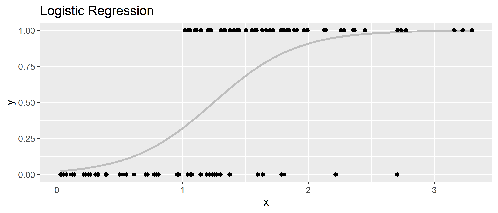

test
========================================================
author: 
date: 
autosize: true

First Slide
========================================================

For more details on authoring R presentations please visit <https://support.rstudio.com/hc/en-us/articles/200486468>.

- Bullet 1
- Bullet 2
- Bullet 3

Slide With Code
========================================================


```r
library(tidyverse)
```
For-loops
========================================================


```r
y <- rbinom(100, 1, prob = 0.5)
x <- abs(rnorm(100)) + y

fit <- glm(y ~ x, family = "binomial")
fit$aic
```

```
[1] 87.20297
```

```r
ggplot(tibble(x,y), aes(x=x, y=y)) +
  geom_smooth(method = "glm", method.args = list(family = "binomial"), se = FALSE, color="grey") +
  geom_point() + labs(title="Logistic Regression")
```



***

For-loops are easy and usefull, but can sometimes be slow. I calculate simulate data and calculate a logistic regression, i then run this 10 times in a for-loop each time saving the coeffecient.


```r
fits <- NA

for (i in 1:6) {
  
  y   <- rbinom(100, 1, prob = 0.5)
  x   <- abs(rnorm(100)) + y * 2
  fit <- glm(y ~ x, family = "binomial")
  
  fits[i] <- fit$aic
  
}

kable(fits)
```


|        x|
|--------:|
| 54.01352|
| 16.14906|
| 14.45138|
| 38.42219|
| 31.37684|
|  4.00000|
